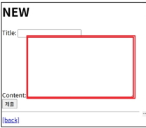

# ***Widgets***

HTML 코드의 'input' element 의 표현을 담당하는 구성요소로 각 필드가 HTML 에서 어떻게 렌더링 될 지를 결정한다. 다양한 위젯 클래스가 존재하고 이를 이용해 입력 방식과 속성을 세부 조정할 수 있다.
  
```python
# articles/forms.py
from django import forms

class ArticleForm(forms.Form):
  title = forms.CF(ml=10)
  content = forms.CF(widget=forms.Textarea)
```
위처럼 CF에 키워드 인자로 넣게되면 페이지의 인풋 폼이 텍스트폼으로 변환된다.  

  
다양한 클래스가 있으니 필요할 때 찾아보자