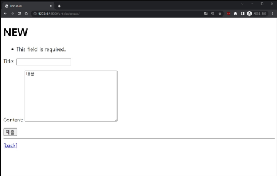
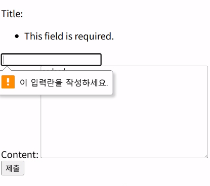

# ***Django ModelForm***

**ModelForm**은 Form 과는 조금 다른데 `Form`은 사용자의 입력 데이터를 DB에 저장하지 않을 때, 즉 `GET` 메서드일 때 사용하고 `ModelForm`은 `POST` 메서드일 때 사용한다. 뭐가 다른걸까?
  
## ModelForm

ModelForm 은 Model과 연결된 Form을 자동으로 생성해주는데 간단하게 생성자와 Form 을 연결한다고 생각하면 된다. 폼을 생성할 때 생성자를 분석해 필요한 필드들의 입력폼을 제공하고 사용자가 입력하면 인스턴스를 자동으로 만들어 DB 저장까지 진행한다.
  
코드를 수정해보자!
```python
# articles/forms.py

from django import forms
from .models import <Model_name>

class <Model_name>Form(forms.ModelForm):
  class Meta:
    model = <Model_name>
    fields = '__all__'
```
<Model_name> 부분에 모델로 정의한 클래스명을 넣어주면 되고 `fields` 의 값은 인풋을 받고 싶은 필드를 넣어주면 된다. `__all__` 을 넣으면 모든 필드에 대한 폼을 다 생성한다.

## Meta class

위 코드를 보면 갑자기 `Meta`라는 클래스가 생겼다. 이 Meta 는 ModelForm 정보를 작성하는 곳으로 폼의 동작 방식을 제어하는 핵심 역할을 한다고 생각하자.
  
위에서 `fields` 에 필드 명을 넣어줬는데 fields 대신 `exclude` 를 넣을 수도 있다. exclude 를 넣게되면 이름대로 제외할 필드를 지정할 수 있다.
  
참고로 Meta는 데이터에 대한 데이터라는 뜻을 가지고 있다. ( 모델폼 데이터에 대한 데이터 )

## ModelForm create

```python
# articles/views.py
from .forms import ArticleForm

def create(request):
  form = ArticleForm(request.POST)
  if form.is_valid():
    article = form.save()
    return redirect('articles:detail', article.pk)
  context ={
    'form' = form,
  }
  return render(request, 'articles/new.html', context)
```
이 코드를 이용하면 유효하지 않은 인풋이 들어왔을 때 에러메시지가 출력되고 다시 입력을 받는다!  

  
바로 `is_valid()` 덕분인데 유효성 검사를 실행하고 데이터가 유효한지 여부를 Boolean 으로 반환해주는 함수이다. 예를 들어 `title` 값에 비정상적인 입력이 들어오면 ( ex. 'space' ) 예외가 터진다.
  

위 오류는 장고와 상관없이 HTML에서 터지는 오류이다! 아무것도 입력하지 않으면 `submit`이 되지 않는다. -> 장고로 넘어오질 않는다.
  
## .save()

`save()` 메서드에는 `return` 값이 존재한다!  
  
아래의 코드를 보자
```python
def create(request):
  form = ArticleForm(request.POST)
  if form.is_valid():
    form.save()
    return redirect('articles:detail', article.pk)
```
마지막에 article.pk 값을 넘겨주고 해당 페이지로 넘어가야하는데 지금 보면 article 이 존재하질 않는다. 따라서 `form.save()` 가 반환을 해주는 값을 받아서 사용해야한다.
  
### 매개변수 'instance'

위의 코드는 `create` 를 구현하지만 `update` 코드는 어떻게 해야할까? 아래를 보자
```python
def update(request):
  form = ArticleForm(request.POST, instance=article)
  form.save()
```
`form` 생성자에 `instance=article` 값이 추가되었다! 이를 통해 인스턴스에 기존에 있던 데이터인지에 대한 여부가 기록되고 `create` 인지 `update` 인지를 구분할 수 있게 된다. 쉽게 새 인스턴스를 만들 것인지 기존 인스턴스를 사용할 것인지 결정한다고 생각하자.
  
