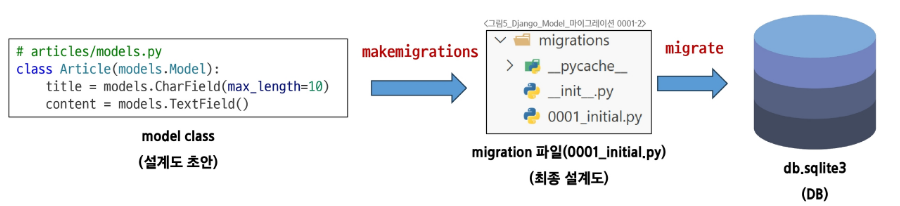

# ***MIGRAIONS***

model 클래스의 변경사항을 DB에 최종 반영하는 방법이다. model 은 청사진이라고 했는데 이 청사진을 DB가 이해할 수 있는 형식으로 전환하는 과정이다.
  
model 클래스를 수정하고 `python manage.py makemigrations` 명령어를 콘솔에 입력하면 앱 폴더에 `migrations` 폴더가 생긴다. 이 폴더 안에 넘버링이 된 파일들이 있는데 이것이 DB가 보는 청사진이다. 모델의 변경사항들이 기록되어있다.
  
`migrations` 폴더를 만들었다면 `python manage.py migrate` 명령어를 이용해 DB에 반영할 수가 있다. 해당 명령어는 migration 파일의 파이썬 코드를 SQL 문으로 자동 변환해준다.  

  
---

## 필드 추가

타입에 대해 기존 테이블이 존재하는데 새로운 필드를 추가해야할 때는 어떻게 해야할까? 우선 코드를 수정하고 `makemigrations` 명령어를 사용하면 된다. 실행하면 Default 값 추가를 요구하는 프롬프트가 나오는데 이에 맞춰 값을 결정하면 된다.
  
기본값을 추가하고 `makemigrations`를 완료하면 migrations 에 추가 migrate 파일이 생성된다. 이는 마치 `git` 에서 버전관리를 하는 것 처럼 **변경사항**만 추적하며 관리하는 형식이라 새 파일에는 변경사항만 기록이 된다. 이로인해 이전 파일들에 대한 의존성이 부여된다.

## 핵심 명령어 !

`python manage.py makemigrations`, `python manage.py migrate`