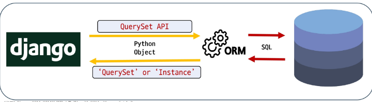

# ***ORM, Object Relational Mapping***

객체 지향 프로그래밍 언어의 객체와 데이터베이스의 데이터를 매핑하는 기술 ( 여기서는 Django ORM 을 다룸 )

## QuerySet API

데이터베이스의 복잡한 SQL 쿼리문을 직관적인 Python 코드로 다룰 수 있게 해주는 번역기로 개발자가 직접 SQL 을 작성하지 않고 .filter(), .exclude(), .order_by() 등 파이썬다운 메서드를 사용해 손쉽게 CRUD 가 가능하도록 해준다.  

  
### QuerySet API 기본 구조

**Article.objects.all()**  
- Article (모델 클래스)
  - 역할: 데이터베이스 테이블에 대한 Python 클래스 표현
  - articles_article 테이블의 스키마(필드, 데이터 타입 등)를 정의하며 Django ORM 이 데이터베이스와 상호작용할 때 사용하는 기본적인 구조체
- .objects (매니저, like manager.py)
  - 역할: 데이터베이스 조회 작업을 위한 기본 인터페이스 ( SQL 메서드가 거의 다 모여있는 듯 하다. maybe Model 클래스에 소속되어 있지 않을까? )
  - 모델 클래스가 데이터베이스 쿼리 작업을 수행할 수 있도록 한다.
  - Django는 모든 모델에 onjects 라는 이름의 매니저를 자동으로 추가하며 이 매니저를 통해 .all(), .filter() 등의 쿼리 메서드 호출
- .all() (SQL 메서드)
  - 역할: 특정 데이터베이스 작업을 수행하는 명령
  - 매니저를 통해 호출되는 메서드로 해당 모델과 연결된 테이블의 모드느 레코드를 조회하라는 쿼리를 생성 및 실행