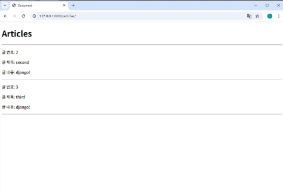

# ORM with views

view 함수에서 OpenSet API 를 사용하는 경우가 있다.
1. 웹 페이지에 보여줄 데이터를 DB 에서 꺼내올 때
2. 사용자가 입력한 데이터를 DB 에 저장할 때
  
코드는 다음과 같다.
```python
# articles/views.py
from django.shortcut import render
from .models import Article

def index(request):
    articles = Article.objects.all()
    context = {
      'articles' = articles,
    }

    return render(request, 'articles/index.html', context)
```
```html
<!-- template/articles/index.html -->
<h1>Articles</h1>
<hr>

  <div>
    {{ article.pk }}
    {{ article.title }}
    {{ article.content }}
  </div>
  <hr>

```
`index` 함수에서 조회한 Article 테이블을 `index.html` 로 넘겨주고 그 안에서 `for`문을 사용해 모든 객체를 출력했다.  
