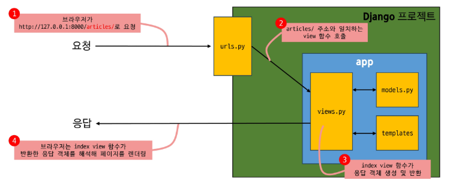

# Request and Reply

클라이언트에서의 요청이 들어오면 다음과 같은 과정을 거친다.
  
요청: `http://~~~:port/appname/`
  
1. URLs:  
    urls.py 파일 내부에서 `appname`의 views를 import 해서 매핑함수 (`path()` in urlpatterns)에 전달한다.  
    `path('appname/', views.func)` 가 해당 부분인데 첫 번째 인자는 url 경로, 두 번째 인자는 url 경로가 유효할 때 호출할 함수를 의미한다.  
    -> appname/ 이 유효하다면 appname 안의 views.py 안의 func 를 호출한다.

2. view
    - 위 appname template과 request 객체를 결합해 응답 객체를 반환한다.  
    ```python
    import render

    def func(request):
        return render(request, 'appname/template.html')
    ```
    이 때 view 안의 함수의 첫 매개변수는 요청 객체로 설정하며 이름은 `request`로 하는 것이 관례이다.

3. Template
    - 앱 폴더 안에 Template 폴더를 만들고 그 안에 다시 앱 명으로 폴더를 만든 뒤 템플릿 파일을 만들어야 한다. 경로는 다음과 같다. ( 위 func 함수에서 두 번째 인자를 저렇게 넘겨주어서 그렇고 저기서 appname 을 제거하면 밑의 경로에서 appname 폴더를 제거해도 된다. Default 경로는 appname/templates 까지인 셈 )  
    `appname/templates/appname/template.html`  

