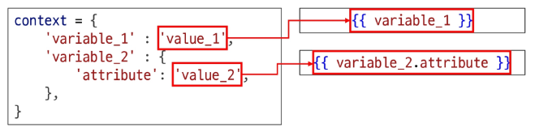
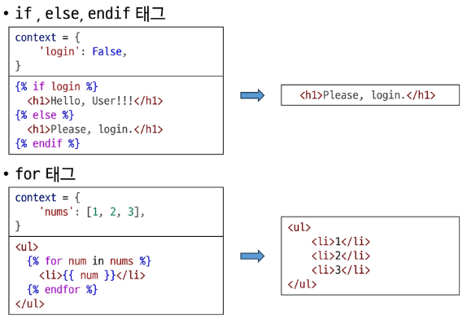
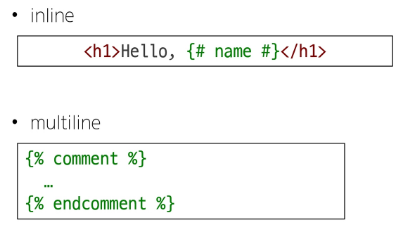

# ***Django Template Language, DTL***

Template 에서 조건, 반복, 변수 등의 프로그래밍적 기능을 제공하는 시스템
  
DTL 문법:
1. Variable
2. Filters
3. Tags
4. Comments

  
## 1. Variable

Django Template 에서의 변수를 의미하며 render 함수의 세번째 인자로 **딕셔너리** 타입으로 전달된다. 해당 딕셔너리의 키값이 Template 에서 사용할 변수명이 된다. ( [DTS](./01_Django_Template_System.md) 에서 설명한 내용 ) 내부 속성에 접근할 때는 `.` 을 사용한다.  
ex. variable.attribute  

  
## 2. Filters

표시할 변수를 수정할 때 사용한다. ( 변수 + | + 필터 )  
체이닝이 가능하며 일부 필터는 인자가 필요한 필터도 있다.
`{{ variable|filter }} 또는 {{ name|truncatewords:30 }}`

## 3. Tags

반복문 또는 조건문을 수행할 수 있게 하는 문법이다.  

  
## 4. Comments

주석 태그이다.  
