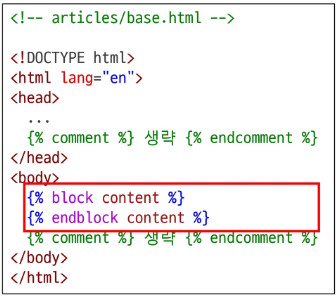
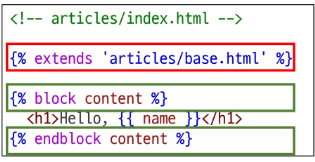
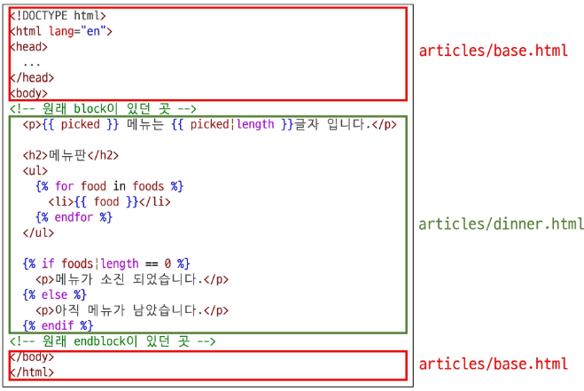

# ***Inheritance***

페이지의 '템플릿'을 만드는 것이다. 반복되는 요소들을 모아두고 하위 템플릿에서 재정의할 수 있는 공간을 의미한다.

## 구조 생성

스켈레톤 코드 역할을 하게 되는 상위 템플릿을 작성한다. 이후 모든 템플릿이 공유해야하는 내용을 작성하고 하위 템플릿이 재정의 해야하는 부분은 block 태그를 활용한다.  
  
  
다음으로 기존 하위 템플릿들이 상위 템플릿을 상속받도록 변경한다. `extend` 태그로 상속 받을 템플릿을 정하고 `block` 태그를 활용해 상위 템플릿과 같은 이름으로 작성된 block 태그의 내용을 대체한다.  

  
이렇게까지 하면 다음과 같은 형태로 구현이 된다.  

