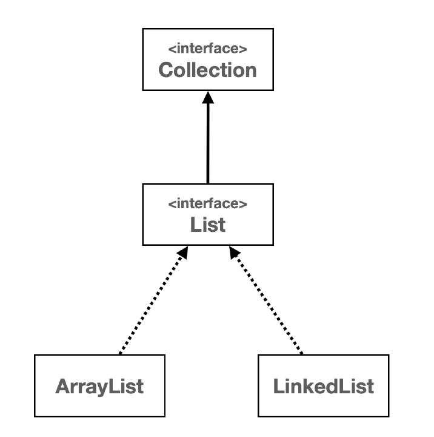

# ***List***

## 리스트 추상화 - 인터페이스 도입
자바 기본편에서 학습한 다형성과 OCP 원칙을 가장 잘 활용할 수 있는 곳 중에 하나가 바로 자료 구조이다.  
어떻게 활용되는지 알아보자!
  
수업을 들으며 `ArrayList` 와 `LinkedList` 의 차이를 알았고 사용하는 곳이 다르다는 걸 알았다.
  
그런데 리스트를 사용하다가 갑자기 다른 형식으로 바꾸고 싶으면 ?  
즉 Array 를 Link 로, Link 를 Array 로 바꿔야하는 상황이 생기면 어떻게 해야할까?  
모든 코드를 다시 짜야한다. 코드를 전부 돌며 Array 는 Link 로 바꿔주고 Link 는 Array 로 바꿔줘야한다.  
근데 둘의 구성은 사실상 같다 !  
  
그래서 등장하는 것이 다형성, `interface`이다.
  
```java
public interface MyList<E> {
    int size();

    void add(E e);
    
    void add(int index, E e);
    
    E get(int index);
    
    E set(int index, E element);
    
    E remove(int index);
    
    int indexOf(E o);
}

public class MyArrayList<E> implements MyList<E> {
    
}

public class MyLinkedList<E> implements MyList<E> {
    
}
```
위와 같이 구성을 하고 각 클래스에 오버라이드 에노테이션을 넣어주면 끝이다.  
이러면 객체의 생성자만 수정하면 모든 코드의 해당 객체의 타입이 변하게 된다 !

## 리스트 추상화2 - 의존관계 주입
이번에는 ArrayList 를 활용해서 많은 데이터를 처리하는 BatchProcessor 클래스를 개발하고 있다고 가정하자.  
그런데 프로그램을 개발하고 보니 `LinkedList` 가 유리한 상황인 앞에서 부터 데이터를 추가하는 일이 많은 상황이다.  
그럼 ArrayList를 LinkedList 로 바꿔주는 편이 효율이 좋게 뽑힐 것이다.
  
```java
public class BatchProcessor {
    private final MyArrayList<Integer> list = new MyArrayList<>();

    public void logic(int size) {
        for (int i = 0; i < size; i++) {
            list.add(0, i);
        }
    }
}
```
이런 코드를 만들었는데 앞에서부터 데이터를 추가한다니 !!  
당장 LinkedList 로 바꿔주는 편이 좋다 !
  
```java
public class BatchProcessor {
    private final MyLinkedList<Integer> list = new MyLinkedList<>();

    public void logic(int size) {
        for (int i = 0; i < size; i++) {
            list.add(0, i);
        }
    }
}
```
이렇게 Array 만 Linked 로 바꿔주면 간단하게 모든 코드에 영향을 줄 수 있다.
  
이런 식으로 `MyArrayList` 또는 `MyLinkedList` 를 사용하는 걸 BatchProcessor 가 구체적인 클래스에 의존한다고 표현한다.  
이렇게 구체적인 클래스에 직접 의존하면 클래스를 바꾸고 싶을 때마다 여기에 의존하는 BatchProcessor 의 코드도 함께 수정해야한다.
  
귀찮다 !  
  
그래서 `BatchProcessor`가 구체적인 클래스가 아니라 추상적인 MyList 인터페이스에 의존하는 방법도 있다.

```java
public class BatchProcessor {
    
    private final MyList<Integer> list;

    public BatchProcessor(MyList<Integer> list) {
        this.list = list;
    }
    
    public void logic(int size) {
        for (int i = 0; i < size; i++) {
            list.add(0, i);
        }
    }
}

main() {
    new BatchProcessor(new MyArrayList());
    new BatchProcessor(new MyLinkedList());
}
```
이렇게 인스턴스 생성 시점에 생성자를 통해 원하는 리스트 전략을 선택해서 전달하면 된다.  
이렇게 하면 MyList 를 사용하는 클라이언트 코드인 BatchProcessor 를 전혀 변경하지 않고 원하는 리스트 전략을
런타임에 지정할 수 있다.
  
```java
public class BatchProcessor {
    private final MyList<Integer> list;

    public BatchProcessor(MyList<Integer> list) {
        this.list = list;
    }

    public void logic(int size) {
        long startTime = System.currentTimeMillis();
        for (int i = 0; i < size; i++) {
            list.add(0, i);
        }
        long endTime = System.currentTimeMillis();
        System.out.println("크기: " + size + ", 계산 시간: " + (endTime - startTime) + "ms");
    }
}
```
이 코드의 `logic` 메서드가 사실 매우 복잡한 비즈니스 로직을 다룬다고 가정하자. 이 메서드는 리스트의 앞 부분에 데이터를 추가한다.  
그럼 MyList 의 두 구현체 중 어떤 걸 선택할 지는 실행 시점에 생성자를 통해 결정한다.  
이건 마치 BatchProcessor 의 외부에서 의존관계가 결정되어서 BatchProcessor 인스턴스에 들어오는 것 같이 보인다.  
그래서 의존관계가 외부에서 주입되는 것 같다고 해서 이것을 의존관계 주입이라고 한다. (생성자를 통해 주입했기 때문에
생성자 의존관계 주입이라고 한다.)
  
**의존관계 주입**
- Dependency Injection, 줄여서 DI 라고 부른다. 의존성 주입이라고 한다.
  
코드는 다음과 같다.
```java
public class BatchProcessorMain {
    public static void main(String[] args) {
        MyArrayList<Integer> list = new MyArrayList<>();
        //MyLinkedList<Integer> list = new MyLinkedList<>();
        
        BatchPocessor processor = new BatchProcessor(list);
        processor.logic(50_000);
    }
}
```
이렇게 구현체의 객체를 만들고 이걸 `BatchProcessor` 의 생성자에 객체를 넣으면 해당 객체 타입의 BatchProcessor 가 만들어진다!
  
## 리스트 추상화3 - 컴파일 타임, 런타임 의존관계
의존관계는 크게 컴파일 타임과 런타임 의존관계로 나눌 수 있다.
- 컴파일 타임 : 코드 컴파일 시점
- 런타임 : 프로그램 실행 시점

### 컴파일 타임 의존관계
- 컴파일 타임 의존관계는 자바 컴파일러가 보는 의존관계이다. 클래스에 모든 의존관계가 다 나타난다.
- 클래스의 바로 보이는 의존관게이다. 그리고 실행하지 않은 소스 코드에 정적으로 나타나는 의존관계이다.
- 위의 BatchProcessor 클래스를 보면 MyList 인터페이스만 사용한다. 어디에도 Array 나 Linked 에 대한 내용은 보이지 않는다.
  
### 런타임 의존관계
- 런타임 의존관계는 실제 프로그램이 작동할 때 보이는 의존관계이다. 주로 생성된 인스턴스와 그것을 참조하는 의존관계이다.
- 프로그램이 실행될 때 인스턴스 간의 의존관계로 보면 된다.
- 런타임 의존관계는 프로그램 실행 중에 계속 변할 수 있다.
  
### 정리
- BatchProcessor 클래스는 구체적인 MyArrayList 나 MyLinkedList 에 의존하는 것이 아니라 추상적인 MyList 에 의존한다.
따라서 런타임에 MyList 의 구현체를 얼마든지 선택할 수 있다.
- BatchProcessor 에서 사용하는 리스트의 의존관계를 클래스에서 미리 결정하느 것이 아니라 런타임에 객체를 생성하는 시점으로 미룬다.
- 이렇게 생성자를 통해 런타임 의존관계를 주입하는 것을 생성자 의존관계 주입 또는 줄여서 생성자 주입이라 한다.
- 자바 기본편에서 학습한 OCP 원칙을 지켰다. 클라이언트 코드의 변경 없이 구현 알고리즘은 MyList 인터페이스의 구현을
자유롭게 확장할 수 있다.
- **클라이언트 클래스틑 컴파일 타임에 추상적인 것에 의존하고, 런타임 의존 관계 주입을 통해 구현체를 주입받아 사용함으로써 이런 이점을 얻는다.**

## 전략 패턴
디자인 패턴 중에 가장 중요한 패턴을 하나 뽑으라고 하면 전략 패턴을 뽑을 수 있다. 전략 패턴은 알고리즘을 클라이언트 코드의 변경 없이
쉽게 교체할 수 있다. 방금 설명한 코드가 바로 전략 패턴을 사용한 코드이다.  
MyList 인터페이스가 바로 전략을 정의하는 인터페이스가 되고, 각각의 구현체인 MyArrayList, MyLinkedList가 전략의 구체적인 구현이 된다.
그리고 전략을 클라이언트 코드의 변경 없이 쉽게 교체할 수 있다.

## 자바리스트
List 자료 구조  
- 순서가 있고 중복을 허용하는 자료구조를 리스트라한다. 자바의 컬렉션 프레임워크가 제공하는 가장 대표적인 자료 구조이다.  


## 배열 리스트 vs 연결 리스트
대부분의 경우 배열리스트가 성능상 유리하다. 그래서 실무에서도 주로 배열리스트를 기본으로 사용하고
특정 목적에 부합할 때만 연결리스트를 고려한다.
