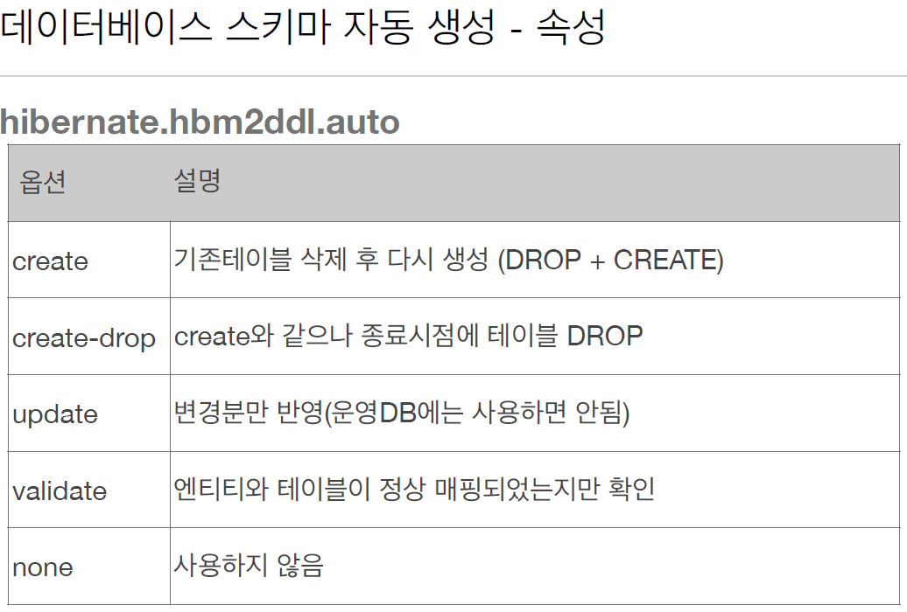
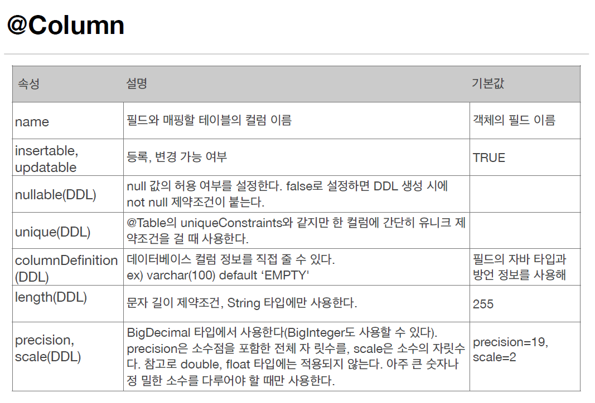
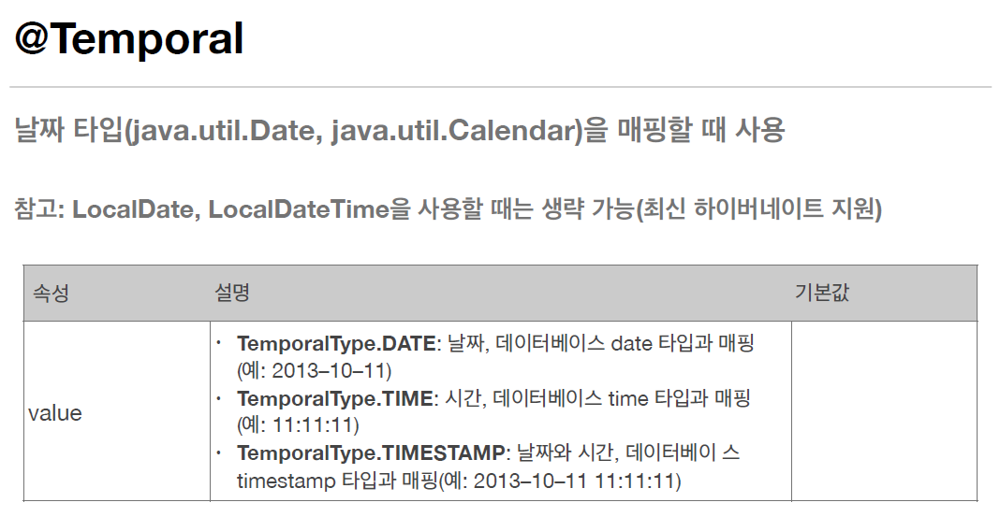
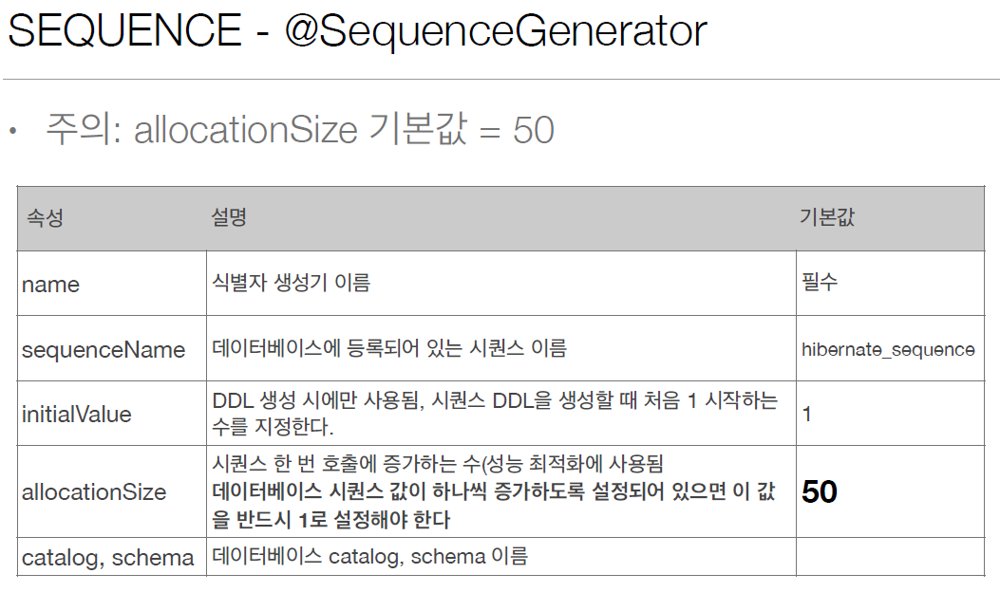
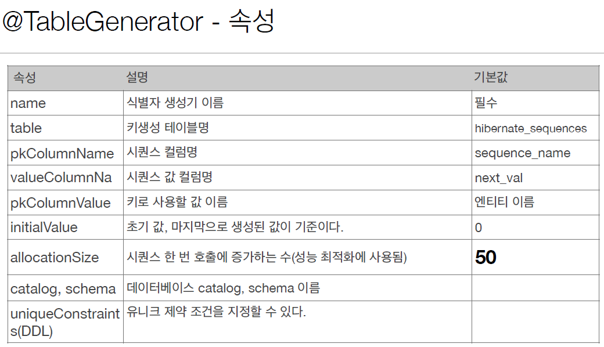

# 엔티티 맵핑

1. 객체와 테이블 매핑: **Entity, @Table**
2. 필드와 컬럼 매핑: **@Column**
3. 기본 키 매핑: **@Id**
4. 연관관계 매핑: **@ManyToOne, @JoinColumn**
  
## 1. 객체와 테이블 매핑

### @Entity

- @Entity 가 붙은 **클래스**는 JPA가 관리하며 엔티티라고 이야기한다.
- JPA를 사용해서 테이블과 매핑할 클래스는 어노테이션을 꼭 붙이자.
- 주의사항
  - **기본생성자 필수**
  - final 클래스, enum, interface, inner 클래스는 사용 X
  - 저장할 필드에 final 을 사용하지 않는다.
- 파라미터
  - name:  
  JPA에서 사용할 이름을 지정한다. 기본값은 클래스 이름이며 같은 클래스 이름이 없다면 기본값을 사용하도록 권장된다.

### @Table

- @Table은 엔티티와 매핑할 테이블을 지정한다. 
- 파라미터
  - name: 매핑할 테이블 이름 ( 기본값: 엔티티 이름 )
  - catalog: 데이터베이스 catalog 매핑
  - schema: 데이터베이스 schema 매핑
  - uniqueConstraints( DDL ): DDL 생성 시에 유니크 제약 조건 생성

> DDL:  
> SQL 의 한 종류로 흔히 이야기하는 CRUD 는 데이터를 다루는 SQL ( DML )이고 DDL 은 테이블을 다루는 SQL 이다. 테이블 생성, 컬럼 추가, 제약조건 설정 등이 있다.

> 참고:  
> catalog 와 schema 는 DB 내부의 directory 라고 이해하면 될 것 같다. table 은 entity 정보를 DB에서 담아두는 파일이고 이 비슷한 파일들을 넣어둔 폴더를 스키마, 이 스키마를 넣어둔 폴더를 카탈로그라고 이해했다.
> DB > catalog > schema > table (entity)

### DB 스키마 자동 생성

JPA 는 DDL 을 애플리케이션 실행 시점에 자동 생성한다. 데이터베이스 방언을 활용해서 데이터베이스에 맞는 적절한 DDL 을 생성한다. 이렇게 자동생성된 DDL 은 개발장비에만 사용하는 것이 권장되고 운영서버에서는 사용하지 않거나 적절하게 다듬은 후 사용하는 게 바람직하다.  
이 자동생성 덕분에 테이블을 설계하고 객체를 만드는 게 아니라 만든 객체를 활용해 테이블을 만드는 것이 가능해진다. 테이블 중심의 개발에서 객체 중심의 개발이 되는 것이다 !  

  
> 주의 !!
> 운영 장비에는 절대 create, create-drop, update 를 사용하지 말자. 심각한 버그를 야기한다! ( 테이블 말소, 락 등 )
> 개발 초기 단계에 create 또는 update 를 사용하는 경우가 있고 협업을 하는 테스트 서버에서는 update 또는 validate 라고 생각하자.

### DDL 생성 기능

각 칼럼에 제약조건을 추가한다. 예를 들어 `@Column(nullable = false, length = 10)` 이 코드는 회원 이름은 필수요소이고 10자를 초과하면 안된다는 제약을 건다.  
이 기능은 DDL 을 자동 생성할 때만 사용되고 JPA 의 실행 로직 ( 런타임 ) 에는 영향을 주지 않는다. `@Table(name = A)` 라고 테이블을 매핑해버리면 이는 조회가 안된다거나 하는 영향이 생길 수 있다.


## 2. 필드와 컬럼 매핑

다음 요구사항이 추가되었다고 가정하자.
1. 회원은 일반 회원과 관리자로 구분해야 한다.
2. 회원 가입일과 수정일이 있어야 한다.
3. 회원을 섦여할 수 있는 필드가 있어야 한다. 이 필드는 길이 제한이 없다.

```java
@Entity
public class Member {
    @Id
    private Long id;
    
    @Column(name = "name")
    private String username;
  
    private Integer age;
    
    @Enumerated(EnumType.String)
    private RoleType roleType;
    
    @Temporal(TemporalType.TIMESTAMP)
    private Date createdDate;
    
    @Temporal(TemporalType.TIMESTAMP)
    private Date lastModifiedDate;
  
    @Lob
    private String description;
}
```
다음과 같이 정리된다.
- @Column: 컬럼 매핑  


- @Temporal: 날짜 매핑 ( `Date` 가 아닌 `LocalDateTime` 또는 `LocalDate` 를 사용할 때는 생략할 수 있다. )


- @Enumerated: enum 타입 매핑
- @Lob: BLOB, CLOB 매핑
  - @Lob 에는 지정할 수 있는 속성이 없고 매핑하는 필드 타입이 문자 ( String, char, sql.CLOB ) 면 CLOB 매핑, 나머지는 BLOB 매핑이다.
- @Transient: 위 예시에는 없지만 매핑하지 않을 필드에 붙인다. 해당 필드는 DB에 저장되지 않는다.

## 3. 기본키 매핑

기본 키 매핑 어노테이션은 **@Id** 와 **@GeneratedValue** 두 가지가 있다. @Id 는 직접 키값을 할당하고 @GeneratedValue 는 자동으로 생성하는 것이다.
```java
@Id @GeneratedValue(strategy = GenerationType.AUTO)
private Long id;
```
@GeneratedValue 속성값으로 다음과 같은 전략을 갖는다.
- IDENTITY: 생성을 데이터베이스에 위임, MYSQL
- SEQUENCE: 데이터베이스 시퀀스 오브젝트 사용, ORACLE
  - @SequenceGenerator 가 필요하다.
- TABLE: 키 생성용 테이블 사용, 모든 DB에서 사용 가능하다.
  - @TableGenerator 가 필요하다.
- AUTO: 방언에 따라 자동 지정한다. 기본값이다.

### IDENTITY 전략

**특징**  
- 기본 키 생성을 데이터 베이스에 위임한다. 데이터 베이스에 위임하기에 초기값 또한 데이터베이스에서 받아와야하는데 이를 위해 em.persist() 시점에 즉시 INSERT SQL을 실행하고 DB 에서 식별자를 조회한다. 보통 트랜잭션 커밋 시점에 INSERT SQL 을 실행하는 JPA 의 흐름과는 다르다.  
```java
@Entity
public class Member {
    @Id
    @GeneratedValue(strategy = GenerationType.IDENTITY)
    private Long id;
}
```

### SEQUENCE 전략

**특징**  
- 데이터베이스 시퀀스는 유일한 값을 순서대로 생선하는 특별한 데이터베이스 오브젝트로 다음과 같은 속성이 있다.  
  
`allocationSize`는 batch 의 개념을 생각하면 편한데 시퀀스는 pk 값을 부여할 때마다 ( em.persist() ) DB 에 접근해서 nextValue 를 조회한다. 하지만 이렇게 하면 조회할 때 드는 비용이 계속 커지기 때문에 한 번 조회할 때 값을 많이 불러온다! 50개를 가져오면 50개를 다 쓸 때까지는 DB에 접근하지 않는다. 이 값을 메모리에 저장해두는데 그렇기에 서버가 다운되면 값이 사라져서 구멍이 생긴다. ( DB는 50개의 값을 빼뒀기 때문에 pk 값이 1이었다면 next pk는 51로 갱신된다. ) 하지만 이는 크게 신경쓸 정도의 장애를 유발하지는 않는다.

### TABLE 전략

키 생성 전용 테이블을 하나 만들어 데이터베이스 시퀀스를 흉내내는 전략으로 모든 데이터베이스에 적용 가능하지만 성능에 영향을 줄 수 있다. 잘 사용되지 않으니 추후 필요해지면 다시 자세히 알아보자.    


> 권장 전략:  
> Long + 대체키 + 키 생성전략을 사용하자.