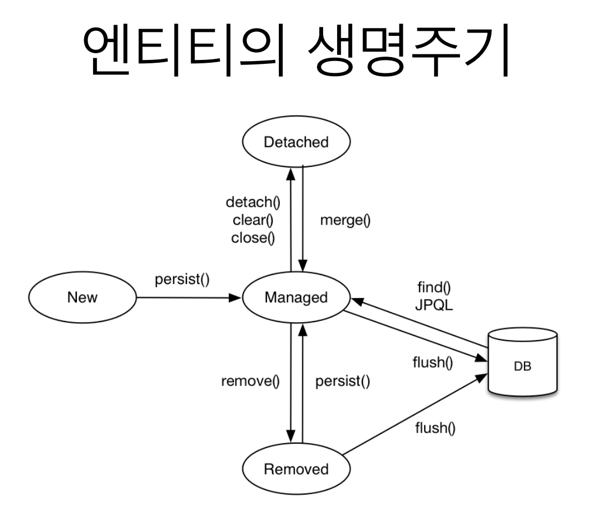

# 영속성 컨텍스트

JPA 에서 가장 중요한 두 가지가 있다 !
1. 객체와 관계형 데이터베이스 매핑 ( ORM )
2. **영속성 컨텍스트**
  
수업을 들으며 생각해보니 일종의 "작업대" 라는 생각이 자꾸만 들었다. 마치 Git 의 staging area 같이 현재 작업을 진행하는 객체들을 꺼내서 관리하는 테이블! 작업을 마치면 커밋을 통해 DB에 저장한다.  
"엔티티 매니저가 추적 중인 객체" 라고 생각해보자
  
## 엔티티 매니저와 영속성 컨텍스트

우선 영속성 컨텍스트는 논리적인 개념으로 눈에 보이지 않는다. 오직 엔티티 매니저를 통해야만 영속성 컨텍스트에 접근이 가능하다.  
영속성 컨텍스트에 대해 이야기하기 위해서는 엔티티의 생명주기를 알아야한다.
- 비영속 ( new / transient ):  
  영속성 컨텍스트와 전혀 관계가 없는 새로운 상태
- 영속 ( managed ):  
  영속성 컨텍스트에 관리되는 상태
- 준영속 ( detached ):  
  영속성 컨텍스트에 저장되었다가 분리된 상태
- 삭제 ( removed ):  
  삭제된 상태
  

  
추적 중이지 않은 상태는 **비영속**, 추적 중이라면 **영속**, 추적을 중단한 상태는 **준영속**, 존재를 지웠다면 **삭제**인 것이다.
  
그럼 이 영속성 컨텍스트는 어떤 이점이 있는걸까?

## 영속성 컨텍스트의 이점

1. 1차 캐시를 제공한다.  
  DB에 접근하는 것도 비용이 존재하는데 이 영속성 컨텍스트 ( 1차 캐시 )는 메모리에 위치하기 때문에 네트워크 접근 비용이 들지 않는다. 영속성 컨텍스트가 없다면 객체를 추적하기 위해서는 DB에 집어넣어야하고, 조회하기 위해서는 DB에서 꺼내야한다.
2. 동일성 ( identity ) 보장  
  아직 잘 이해하지 못했다. 강의에서는 다음과 같이 설명한다. `1차 캐시로 반복 가능한 읽기 등급의 트랜잭션 격리 수준을 데이터베이스가 아닌 애플리케이션 차원에서 제공`  
  1차 캐시에서 같은 객체를 두 번 조회해 다른 변수에 담았을 때 그 두 변수의 동일성 ( == )을 보장한다는 뜻인 것 같다. (DB는 보장을 안하나? > DB는 **값**만 신경쓴다. 값을 불러와서 객체로 변환하는건 JPA의 역할이기 때문에 서로 다른 인스턴스가 될 수 있다!)
    
3. 트랜잭션을 지원하는 쓰기 지연  
  엔티티 매니저는 데이터 변경시 트랜잭션을 시작할 필요가 있다. 트랜잭션을 시작하고 객체를 컨텍스트에 저장하면 ( 1차 캐시 ) 동시에 지연 SQL 저장소에 SQL 쿼리가 저장된다. 그 때 쿼리를 DB로 보내지는 않고 커밋할 때까지 기다렸다가 트랜잭션 커밋이 발생하면 DB에 접근해서 SQL을 한 번에 처리( flush ) 한다. ( Flush: 컨텍스트와 DB의 상태를 맞추는 작업 )
4. 변경 감지 ( Dirty checking )  
  Django를 생각해보자. 장고에서는 DB를 업데이트 하기 위해 객체를 꺼내고 수정한 뒤 동기화 작업이 ( save() ) 필요하다. 이 과정을 JPA 에서는 생략한다. 컨텍스트에서 자동으로 진행한다. 이 또한 SQL 쿼리를 작성해두었다가 커밋시에 flush 를 진행한다. ( 삭제도 동일하다. )
5. 지연 로딩 ( Lazy Loading )  
  ~~찾아보자 !~~  
  테이블 안에 객체가 들어있을 때 ( 다른 테이블의 PK를 외래키, FK 로 들고 있을 때 ) 테이블 조회과 동시에 내부 객체까지 가져오는게 아니라 그 객체를 식별할 수 있는 **프록시**를 만들었다가 해당 객체가 필요해지면 그 때 조회하는 방법이다.

**FLUSH**  
영속성 컨텍스트의 변경내용을 데이터베이스에 반영하는 작업이다. 플러시는 직접 호출할 수도 있고 자동으로 호출되는 경우도 있다.
- 직접호출: `em.flush()`  
- 자동호출: 트랜잭션 커밋 시, JPQL 쿼리 실행 시  
  
플러시는 영속성 컨텍스트를 비우지 않고 그저 변경사항을 데이터베이스에 동기화할 뿐이다. 플러시에는 트랜잭션이라는 작업 단위가 중요하며 커밋 직전에만 동기화 하면 된다. 즉, JPA는 트랜잭션 안에서 일어난 변경을 바로바로 DB에 반영할 필요가 없다. 트랜잭션이 하나의 작업 단위이므로, 최종 확정 시점인 커밋 직전에만 DB와 동기화해도 된다.

  
**준영속 상태**  
추적을 하다가 종료한 상태로 엔티티가 영속성 컨텍스트에서 분리된 상태이다. 당연하게도 영속성 컨텍스트의 기능을 사용하지 못한다. 이를 이용해 추적을 중단해야할 때 엔티티를 준영속 상태로 만들어 이점을 누릴 수 있다.
엔티티를 준영속 상태로 만드는 방법은 다음과 같다.
- `em.detach(entity)`  
  특정 엔티티만 준영속 상태로 전환  
- `em.clear()`  
  영속성 컨텍스트를 완전히 초기화
- `em.close()`  
  영속성 컨텍스트를 종료