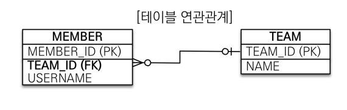

# 연관관계 매핑

> 객체지향 설계의 목표는 자율적인 객체들의 협력 공통체를 만드는 것이다. - 객체지향의 사실과 오해 中

**요구사항**
1. 회원과 팀이 있다.
2. 회원은 하나의 팀에만 소속될 수 있다.
3. 회원과 팀은 다대일 관계이다.
---
- 객체를 테이블에 맞추어 모델링 ( 연관관계가 없는 객체 )

우선 테이블을 먼저 설계한다.

  
이 후 테이블에 맞추어 객체를 만든다.
```java
@Entity
public class Member {

    @Id @GeneratedValue
    private Long id;
    
    @Column(name = "USERNAME")
    private String name;
    
    @Column(name = "TEAM_ID")
    private Long teamId;
}

@Entity
public class Team {
    @Id @GeneratedValue
    private Long id;
    private String name;
}
```
그러면 위와 같은 클래스가 만들어진다. 그럼 위 코드를 이용해 데이터를 저장해보자.

```java
// 팀 저장
Team team = new Team();
team.setName("TeamA");
em.persist(team);

// 회원 저장
Member member = new Member();
member.setName("member1");
member.setTeamId(team.getId());
em.persist(member);

// 조회
Member findMember = em.find(Member.class, member.getId());

// 연관관계가 없음
Team findTeam = em.find(Team.class, team.getId());
```
우선 회원 정보에 팀을 저장하는 것부터 마음에 들지 않는다. 지금은 `team` 객체의 Id 값을 조회하고 그 값을 다시 `member` 객체에 넣고 있어서 멤버의 팀을 조회하기 위해서는 반대로 팀 Id를 꺼내고 그 값을 이용해서 팀을 찾아야한다. `member.setTeam(team)` 을 이용해서 객체를 넣으면 일련의 과정들이 생략될 것이다!  
  
이렇게 객체를 테이블에 맞추어 데이터 중심으로 모델링하면 협력 관계를 만들 수 없다. 이는 패러다임의 차이 때문에 발생하는데, **테이블은 외래 키를 이용해 연관 테이블을 찾고 객체는 참조를 사용해서 연관 객체를 사용한다**는 차이가 있다.  
  
그럼 바로 객체 지향 모델링을 해보자.

## 객체 지향 모델링

우선 코드부터,
```java
@Entity
public class Member {
    @Id @GeneratedValue
    private Long id;
    
    @Column(name = "USERNAME")
    private String name;
    
    @ManyToOne  // Many = Member, One = Team
    @JoinColumn(name = "TEAM_ID")
    private Team team;
}
```
이 코드는 다음과 같이 말하고 있다.  
> Member 클래스는 필드로 Long id, String name, Team team 를 가지고, Team 과 Many to One 관계를 맺고 있으며 team 필드는 DB 의 Member Table 의 TEAM_ID 와 연결되어 있다.
  
이 부분에서 다른 건 괜찮았는데 `@ManyToOne` 어노테이션의 역할에 대해서 고민이 있었다. 이게 사람을 위한 주석의 기능을 하는건지 프로그램 상에서 실질적인 의미를 갖는건지가 헷갈렸다. 결론은 JPA의 작동을 돕는역할을 한다. 객체간의 **관계**를 나타내어 JPA 의 SQL 작성을 돕고 객체 그래프 관리에 도움을 준다고 한다. 추후 필요성을 느끼면 더 깊게 찾아보자.
  
아무튼 위와 같은 구성은 member 에서 team 을 찾을 때 `Team findTeam = findMember.getTeam()` 을 이용해 찾을 수 있다! 또한 팀 설정 또한 `member.setTeam(teamB)` 로 편하게 가능하다.
  
## 양방향 매핑과 연관관계의 주인

단방향 매핑은 Member -> Team 같이 한 쪽에만 다른 쪽의 정보가 있는 걸 의미하는데 양방향 매핑은 서로서로 정보를 갖는 걸 의미한다. 위의 코드에서 볼 때 Team 객체가 Member 에 대한 필드를 갖는 걸 의미한다.  
  
```java
@Entity
public class Member {
    @Id @GeneratedValue
    private Long id;
    
    @Column(name = "USERNAME")
    private String name;
    private int age;
    
    @ManyToOne
    @JoinColumn(name = "TEAM_ID")
    private Team team;
}

@Entity
public class Team {
    @Id @GeneratedValue
    private Long id;
    
    private String name;
    
    @OneToMany(mappedBy = "team")
    List<Member> members = new ArrayList<Member>();
}
```
이렇게 Member 에 Team 의 정보도 있고 Team 에도 Member 의 필드를 만드는 걸 양방향 매핑이라고 한다. 그런데 보면 단방향 매핑때는 보이지 않던 `mappedBy` 라는 속성이 생겼다. Team 에서 Member 이니까 `@OneToMany` 는 알겠는데 `mappedBy`?
  
mappedBy 는 쉽게 `implements`라고 생각해도 될 것 같다. 클래스를 상속 받을 때 implements 를 사용해 해당 클래스의 관계를 명시해주는 것과 같이 `mappedBy` 또한 어떤 엔티티에 종속되는 지 ( 종속과는 조금 다른 것 같지만 ) 표현하는 속성이다. 엔티티 관계에서는 부모클래스를 `관계의 주인`이라고 표현하며 주인이 아닌 하위 엔티티는 mappedBy 를 명시해줘야한다.
  
그럼 이 관계의 주인은 어떻게 정해야할까? 우선 관계의 주인 몇 가지 특징을 갖는데 먼저 연관관계의 주인만이 테이블내 **외래 키를 관리 ( 등록, 수정 )할 수 있다**는 점이 있고 또 **주인이 아닌 쪽은 읽기만 가능하다**는 점이 있다.  
보통 외래 키가 있는 곳을 주인으로 정하는 것이 권장된다. 위 코드에서는 Member 에 외래 키가 있기 때문에 ( TEAM_ID ) Member 가 관계의 주인이 된다. 참고로 Team의 테이블에는 member 컬럼이 만들어지지 않는다!

### 정리

가급적이면 양방향 매핑은 사용하지 않고 설계를 마치는 것이 좋다. 단방향만으로도 충분히 설계가 가능하고 양방향은 이후 필요하다고 느껴지면 그 때 추가해도 충분하다. ( 그래프 탐색 기능을 추가하는 것 뿐 ) 그리고 연관관계의 주인을 정할 때 비즈니스 로직을 기준으로 정하면 안되고 외래 키의 위치를 기준으로 정해야한다. ( 보통 ManyToOne 이 주인이 되는 것 같다. )
  
> **주의**:  
> 양방향 매핑을 할 때는 순수 객체 상태를 고려해서 항상 양쪽에 값을 설정해줘야한다. 그리고 무한 루프를 조심하자 !

