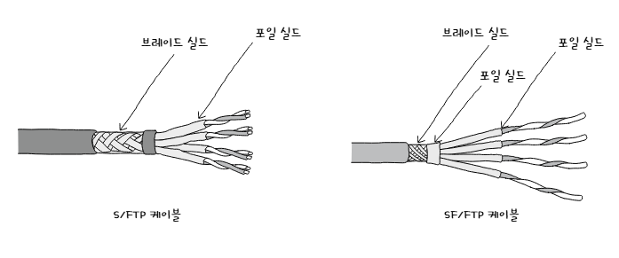

# ***NIC와 케이블***

**NIC, Network Interface Controller** 는 호스트와 통신 매체를 연결하고 MAC 주소가 부여되는 네트워크 장비이다. 그리고 **케이블, Cable**은 NIC에 연결되는 물리 계층의 유선 통신 매체이다. 그 종류에는 대표적으로 **트위스티드 페어 케이블**과 **광섬유 케이블**이 있다.
  
## NIC
통신 매체에는 전기나 빛과 같은 다양한 신호가 흐르는데 호스트가 이를 이해하기 위해서는 컴퓨터의 언어로 변환하는 과정이 필요한데 이 신호의 연결과 변환을 담당하는 네트워크 장비가 **NIC** 이다.  
이 NIC는 네트워크 인터페이스 카드, 네트워크 어댑터, LAN 카드, 네트워크 카드, 이더넷 카드 등 다양한 명칭으로 불린다.
  
NIC는 신호를 변환하는 역할을 진행하기 때문에 호스트가 네트워크를 통해 송수신하는 정보는 NIC를 거치게 된다. 이렇게 연결점을 담당하는 점에서 **네트워크 인터페이스, Network Interface** 역할을 수행한다고도 이야기 한다.
  
네트워크 인터페이스 역할을 수행하는 것은 MAC 주소를 통해 자기 주소는 물론 수신되는 프레임의 수신지 주소를 인식한다. 그래서 도착한 프레임이 자신과 관련 없는 MAC 주소를 갖고 있을 때 폐기할 수 있고 FCS 필드를 토대로 오류를 검출해 잘못된 프레임을 폐기할 수도 있다.

## 케이블
통신 매체로 연결된 두 호스트의 성능이 아무리 좋아도 정작 통신 매체가 속도를 따라가지 못하면 아무 의미가 없다. 그만큼 통신 매체에 대한 이해는 중요하다.

### 트위스티드 페어 케이블, Twisted Pair Cable
**트위스티드 페어 케이블**은 구리 선으로 전기 신호를 주고받는 통신 매체이다. LAN 케이블이라고 하면 가장 먼저 떠오를 만큼 많이 사용되는 케이블 중 하나이다.
  
이 케이블은 **케이블 본체**와 케이블의 연결부인 **커넥터, Connector** 로 이루어져 있다. 우리가 주로 사용하는 LAN 선의 접속부에 있는 커넥터는 **RJ-45** 라고 부른다.
  
케이블 내부를 뜯어보면 이름과 같이 구리선이 두 가닥씩 꼬여있는 것을 볼 수 있다. 그런데 이렇게 구리 선으로 전기 신호를 주고받으면 외부의 전자적 간섭인 **노이즈**가 생길 수 있다. 트위스티드 페어 케이블은 구리 선으로 이루어져있어서 노이즈에 민감하다. 그래서 이 구리 선을 그물 모양의 철사 또는 포일로 감싸 보호하는 경우가 많다. 이렇게 노이즈를 감소시키는 방식을 **차폐,  Shiekling**이라 하고 사용된 그물 모양의 철사와 포일을 각각 **브레이드 실드, Braided Shield** 혹은 **포일 실드, Foil Shield**라고 한다.
  
사용된 실드에 따라 트위스티드 페어 케이블을 분류하기도 한다. 브레이드 실드를 사용한 트위스티드 페어 케이블은 **STP, Shielded Twisted Pair** 케이블, 포일 실드를 사용한 케이블은 **FTP, Poil Twisted Pair** 케이블이라고 한다. 또 실드를 사용하지 않는 경우도 있는데 이 케이블은 **UTP, Unshielded Twisted Pair** 케이블이라고 한다.
  
사용된 실드를 나타내는 표기법도 있는데 이는 다음과 같다.  
- U: 실드 없음
- S: 브레이드 실드
- F: 포일 실드
- S/FTP, F/FTP, SF/FTP, U/UTP 케이블 등등
슬래쉬 앞은 케이블 전체를, 뒤는 각 구리선을 감싼 실드를 의미한다.  

  
