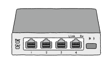

# ***허브***

통신 매체를 통해 송수신되는 메시지는 다른 호스트에게 전달되는 과정에서 네트워크 장비를 거칠 수 있다. 대표적인 네트워크 장비로 물리 계층에는 **허브**가 있고 데이터 링크 계층에는 **스위치**가 있다.
  
우선 허브의 특징을 살펴보고 허브의 동작 방식인 **반이중** 모드 통신을 알아보자. 그리고 반대되는 개념인 **전이중** 모드 통신과 허브에서 발생하는 충돌과 이를 해결하기 위한 프로토콜인 **CSMA/CD**도 다룰 것이다.

## 물리 계층은 주소 개념이 없다

주소 개념은 데이터 링크 계층부터 존재하는 개념이다. 물리 계층에서는 단지 호스트와 통신 매체 간의 연결과 송수신이 이루어진다. 따라서 물리 계층의 네트워크 장비는 정보에 대한 어떤 조작이나 판단도 하지 않는다.  
반면 데이터 링크 계층에는 주소 개념이 있고 (like MAC) 따라서 해당 계층이나 그 이상 계층의 장비들은 송수신지를 특정할 수 있고 주소를 바탕으로 송수신되는 정보에 대한 조작과 판단이 가능하다.

## 허브, Hub

물리 계층의 **허브**는 여러 대의 호스트를 연결하는 장치이다. **리피터 허브, Repeater Hub**라 부르기도 하고 이더넷 네트워크의 허브는 **이더넷 허브, Ethernet Hub**라고도 이야기한다.  
아래의 그림에서 네 개의 구멍을 **포트, Port**라고 한다. 포트에 호스트와 연결된 통신 매체를 연결할 수 있다.  
  

### 허브의 특징

오늘날 인터넷 환경에서 허브는 잘 사용되지 않는다. 하지만 허브가 갖는 두 가지 큰 특징은 중요한 네트워크 개념을 내포하고 있으며 이는 곧 허브가 사용되지 않는 이유와 직결된다.
  
1. 전달받은 신호를 다른 모든 포트로 그대로 다시 내보낸다.
허브는 물리 계층에 속하는 장비이고, 물리 계층은 주소 개념이 없어 허브는 수신지를 특정할 수 없다. 따라서 신호를 받으면 어떠한 조작이나 판단도 하지 않고 송신지를 제외한 모든 포트에 내보낸다. 그럼 이 신호를 받은 호스트는 데이터 링크 계층에서 패킷의 MAC 주소를 확인하고 자신과 관련 없다면 폐기한다.  

2. 반이중 모드로 통신한다.  
**반이중, Half Duplex** 모드는 마치 1차선 도로처럼 송수신을 번갈아 가면서 하는 통신 방식이다. 워키토키를 생각하면 편하다.  
반면 **전이중, Full Duplex** 모드는 송수신을 양방향으로 할 수 있는 통신 방식이다.  

> **리피터, Repeater**  
> 리피터는 전기 신호를 증폭시키는 역할을 하는 물리 계층의 네트워크 장비이다. 허브는 이런 리피터의 기능을 포함하는 경우가 많다.  

### 콜리전 도메인
반이중 통신의 수신도중 송신을 시도하면 **충돌, Collision**이 발생한다.  
허브에 연결된 호스트가 많을 수록 충돌의 발생 가능성이 높다. 이렇게 충돌이 발생할 수 있는 영역을 **콜리전 도메인, Collision Domain**이라고 한다. 허브에 연결된 모든 호스트는 같은 콜리전 도메인에 속한다.
  
## CSMA/CD, Carrier Sense Multiple Access with Collision Detection
충돌이 발생하는 근본적 이유는 허브가 반이중 모드 통신을 지원하기 때문이다. **CSMA/CD** 는 이 충돌 문제를 해결하기 위한 프로토콜로 반이중 이더넷 네트워크에서 충돌을 방지하는 대표적인 프로토콜이다.

1. CS - Carrier Sense, 캐리어 감지
해당 프로토콜을 사용하는 반이중 이더넷 네트워크에서는 메시지를 보내기 전에 현재 네트워크 상에서 통신이 진행 중인지 확인하는데 이를 캐리어 감지라고 한다.

2. MA - Multiple Access, 다중 접근
캐리어 감지를 하더라도 둘 이상의 호스트가 동시에 네트워크를 사용하려 할 때가 생기는데 이런 상황을 다중 접근이라고 한다.

3. CD - Collision Detection, 충돌 검출
충돌이 발생하면 이를 검출해내는데 충돌을 감지하면 전송이 중단되고 검출한 호스트는 다른 호스트에게 이를 알리고자 **잼 신호, Jam Siganl**라는 특별한 신호를 보낸다.