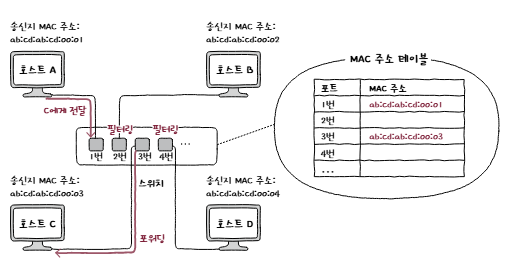
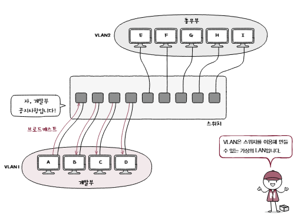
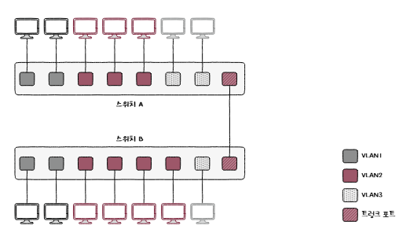

# ***스위치***
  
허브는 주소 개념이 없는 물리 계층 장비이고 전달 받은 신호를 다른 모든 포트로 내보내기 때문에 허브에 연결된 모든 호스트가 충돌이 발생할 범위, 콜리전 도메인에 속한다.
  
CSMA/CD 를 통해 어느정도 문제를 완화할 수 있지만 근본적으로 신호를 수신지 호스트로만 보내고 전이중 모드 통신을 하면 문제가 해결된다. 이러한 기능을 지원하는 네트워크 장비가 **스위치**이다.
  
스위치는 MAC 주소를 학습할 수 있기 때문에 가능한 일이다. 또한 스위치를 사용하면 논리적으로 LAN 을 분리하는 가상의 LAN, **VLAN**을 구성할 수 있다는 장점도 있다.
  
## 스위치, SWITCH
스위치는 데이터 링크 계층의 네트워크 장비로 2계층에서 사용한다고 하여 **L2 Switch**라고도 부른다. 포트에 호스트를 연결한다는 점은 허브와 유사하지만 MAC 주소를 학습해 특정 MAC 주소를 가진 호스트에만 프레임을 전달할 수 있고 전이중 모드 통신을 지원한다는 점이 다르다. 따라서 CSMA/CD 프로토콜 또한 필요가 없다. DSMA/CD 프로토콜은 구조상 대기시간을 발생시켰는데 이 프로토콜을 사용하지 않으니 대기시간도 발생하지 않아 성능상으로도 이점이 있다.
  
### 스위치의 특징
가장 중요한 특징은 **MAC 주소 학습, MAC address learning**이다. MAC 주소 학습을 위해 포트와 연결된 호스트의 MAC 주소 간의 연관 관계를 메모리에 표 형태로 기억한다. 이 표를 **MAC 주소 테이블, MAC address table**이라고 한다.  

  
## MAC 주소 학습
MAC 주소 학습은 스위치의 세 가지 기능을 통해 이루어진다. 해당 용어를 이해하면 스위치의 기본 작동 방식을 이해할 수 있다.

1. 플러딩:
    - 스위치는 처음에 포트와 연결된 호스트의 주소를 알지 못한다. 이후 처음 호스트에게서 프레임을 수신하면 프레임 내 `송신지 MAC 주소` 정보를 바탕으로 호스트의 MAC 주소와 연결된 포트를 테이블에 저장한다. 하지만 확인된 포트 외에는 아직 정보가 없기 때문에 허브처럼 모든 포트에 신호를 보내고 이를 플러딩이라고 한다.
    - 이렇게 신호를 보내면 관련 없는 프레임을 전송받은 호스트는 이를 폐기하고 그렇지 않은 호스트는 응답 프레임을 송신하는데 이 때 이 응답 프레임을 보고 또 포트와 호스트의 MAC 주소를 맵핑한다.
2. 필터링:
  - 이렇게 맵핑을 진행하며 신호를 보낼 포트를 선택하는 것을 필터링이라고 한다.
3. 포워딩:
  - 실제로 프레임을 전송하는 것을 포워딩이라고 한다.
  
만약 테이블에 저장되어있는 포트에서 일정 시간동안 프레임을 전송 받지 못하면 해당 항목은 사라진다. 이를 **에이징**이라고 이야기한다.  
  

## VLAN

스위치의 또 다른 중요한 기능으로 **VLAN, Virtual LAN** 이 있다. 이는 가상의 LAN 을 만드는 방법을 의미한다.  
스위치를 이용하더라도 스위치에 연결된 호스트 중 서로 메시지를 주고 받을 일이 적거나 필요가 없는 등의 이유로 굳이 같은 LAN 에 속할 필요가 없는 호스트가 있을 수 있다. 하지만 이를 분리하고자 새로운 장비를 구비하는 것은 낭비이므로 이 때 VLAN 을 구성한다.  

  
### 포트 기반 VLAN

가장 단순하지만 대중적인 방식으로 포트 기반 VLAN이 있다. 이는 한 마디로 스위치의 포트가 VLAN 을 결정하는 방식으로 물리적으로 VLAN 을 구현한다.  

  
### MAC 기반 VLAN
포트 기반 이외에도 사전 설정된 MAC 주소에 따라 결장하는 MAC 기반 VLAN도 있다.