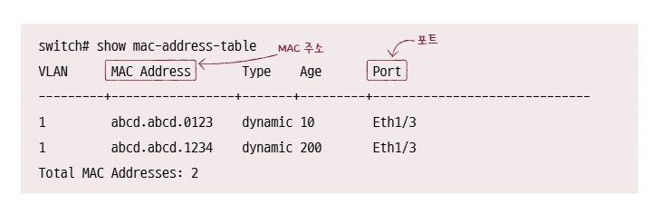

# ***스위치***
  
허브는 주소 개념이 없는 물리 계층 장비이고 전달 받은 신호를 다른 모든 포트로 내보내기 때문에 허브에 연결된 모든 호스트가 충돌이 발생할 범위, 콜리전 도메인에 속한다.
  
CSMA/CD 를 통해 어느정도 문제를 완화할 수 있지만 근본적으로 신호를 수신지 호스트로만 보내고 전이중 모드 통신을 하면 문제가 해결된다. 이러한 기능을 지원하는 네트워크 장비가 **스위치**이다.
  
스위치는 MAC 주소를 학습할 수 있기 때문에 가능한 일이다. 또한 스위치를 사용하면 논리적으로 LAN 을 분리하는 가상의 LAN, **VLAN**을 구성할 수 있다는 장점도 있다.
  
## 스위치, SWITCH
스위치는 데이터 링크 계층의 네트워크 장비로 2계층에서 사용한다고 하여 **L2 Switch**라고도 부른다. 포트에 호스트를 연결한다는 점은 허브와 유사하지만 MAC 주소를 학습해 특정 MAC 주소를 가진 호스트에만 프레임을 전달할 수 있고 전이중 모드 통신을 지원한다는 점이 다르다. 따라서 CSMA/CD 프로토콜 또한 필요가 없다. DSMA/CD 프로토콜은 구조상 대기시간을 발생시켰는데 이 프로토콜을 사용하지 않으니 대기시간도 발생하지 않아 성능상으로도 이점이 있다.
  
### 스위치의 특징
가장 중요한 특징은 **MAC 주소 학습, MAC address learning**이다. MAC 주소 학습을 위해 포트와 연결된 호스트의 MAC 주소 간의 연관 관계를 메모리에 표 형태로 기억한다. 이 표를 **MAC 주소 테이블, MAC address table**이라고 한다.  

  
## MAC 주소 학습