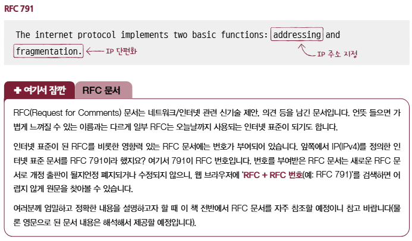

# ***네트워크 계층***

이전까지 학습한 내용들은 네트워크의 범위가 LAN 에 한정된다. 그런데 LAN 을 넘어 다른 네트워크와 통신하기 위해서는 **네트워크 계층**의 역할이 필수적이다. 네트워크 계층에서는 IP 주소를 이용해 송수신지 대상을 지정하고 다른 네트워크에 이르는 경로를 결정하는 **라우팅**을 통해 다른 네트워크와 통신한다.

## 데이터 링크 계층의 한계

물리 계층과 데이터 링크 계층에도 MAC 주소가 있지만 이것만으로 LAN 을 넘어서 통신하기는 어렵다. 이유는 다음과 같다.
1. 물리 계층과 데이터 링크 계층만으로는 다른 네트워크까지의 도달 경로를 파악하기 어렵다.  
통신을 빠르게 주고 받으려면 패킷이 이동해야하는데 이 패킷이 이동할 퇴적의 경로를 결정하는 것을 **라우팅, Routing**이라고 한다. 이 라우팅을 물리계층과 데이터링크 계층의 장비로는 수행할 수가 없다. 하지만 네트워크 계층의 장비로는 가능한데 대표적인 장비로 **라우터, Router**가 있다.
2. MAC 주소 만으로는 모든 네트워크에 속한 호스트의 위치를 특정하기 어렵다.  
일찍이 통신을 택배에 비유했는데 택배의 수신인 역할을 하는 정보가 MAC 주소라면 수신지 역할을 하는 정보는 네트워크 계층의 **IP 주소**이다. 택배에서도 수신인과 수신지 정보가 따로 필요하듯이 통신도 똑같다.
  
MAC 주소를 물리 주소라고도 부르는 것 처럼 IP 주소는 **논리 주소**라고도 부른다. MAC 주소는 일반적으로 NIC 마다 할당되는 고정된 주소이지만 IP주소는 호스트에 직접 할당이 가능하다. **DHCP, Dynamic Host, Configuration Protocol**라는 특정 **프로토콜**을 통해 자동으로 할당받거나 사용자가 직접 할당할 수 있고, 한 호스트가 복수의 IP 주소를 가질 수도 있다.
  
## 인터넷 프로토콜
네트워크 계층의 가장 핵심적인 프로토콜인 **인터넷 프로토콜, IP; Internet Protocol**에는 두 가지 버전이 있다. IP 버전 4 (IPv4), IP 버전 6 (IPv6)이다. 일반적으로 IP 혹은 IP 주소를 이야기하면 주로 IPv4 를 의미하는 경우가 많고 여기서도 그렇다.

### IP 주소 형태
**IP 주소**는 4바이트로 표현할 수 있고 숫자당 8비트로 표현되기 때문에 0~255 범위에 있는 네 개의 10진수로 표기된다. 각 10진수는 점(.)으로 구분되며 각 수를 **옥텟, Octet**이라고 한다. ( ex. 192.168.1.1 )

### IP의 기능
대표적인 두 가지 기능으로 **IP 주소 지정**과 **IP 단편화** 이다.  

  
**IP 주소 지정, IP addressing** 은 IP 주소를 바탕으로 송수신 대상을 지정하는 것을 의미한다. **IP 단편화, IP Fragmentation** 는 전송하고자 하는 패킷의 크기가 MTU 라는 최대 전송 단위보다 클 경우 이를 MTU 크기 이하의 복수 패킷으로 나누는 것을 의미한다. **MTU, Maximum Transmission Unit** 란 한 번에 전송가능한 IP 패킷의 최대 크기를 의미한다. IP 패킷의 헤더도 MTU 크기에 포함된다!